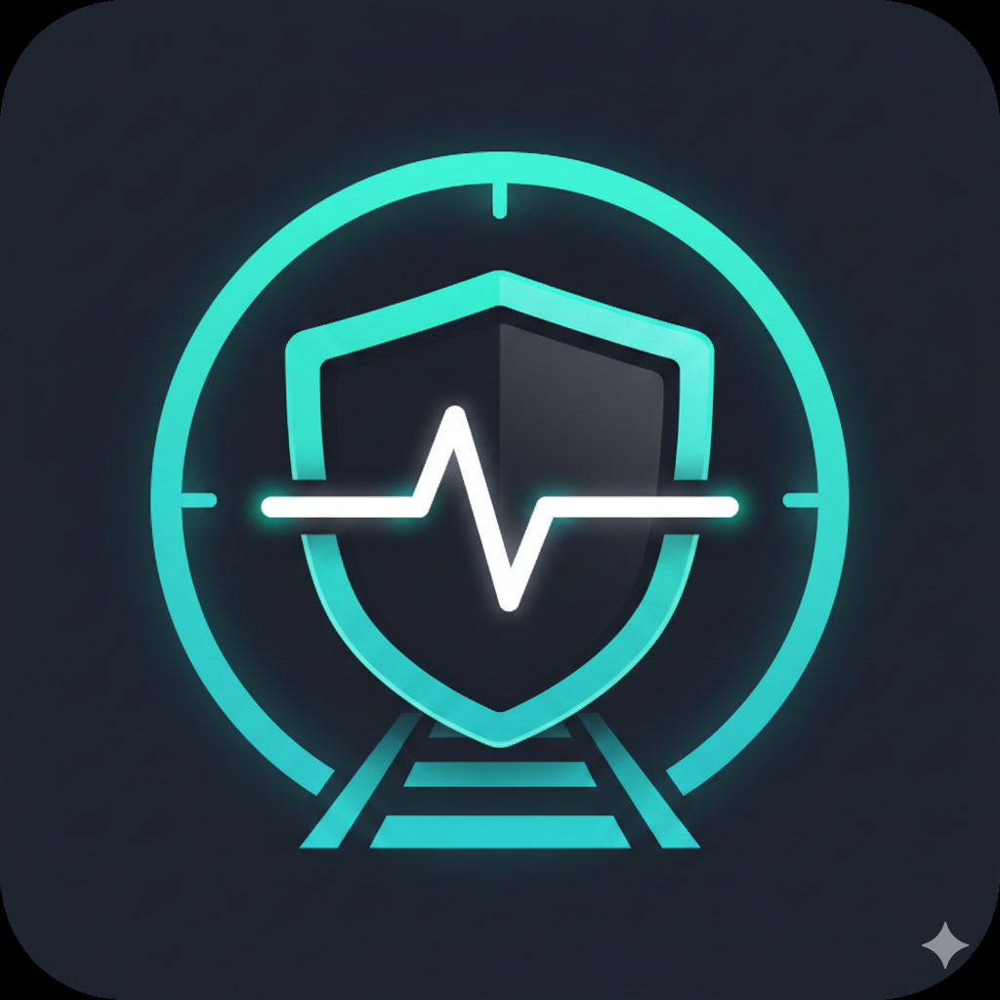

# railway-uptime-monitor



Railway-specific uptime monitoring for private or public service health checks with incident tracking and alert notifications.

## What this does

- Discovers services in a Railway project environment via Railway GraphQL API
- Resolves monitor targets via Railway private domains, public domains, or automatic selection
- Runs recurring HTTP checks with configurable timeout and expected status range
- Tracks monitor state and incidents in local SQLite
- Sends DOWN/RECOVERED notifications to Slack, Discord, Telegram, and Resend email

## Requirements

- Bun `>=1.3.0`
- Railway API token with access to the target project/environment

## Quick start

1. Install dependencies:

```bash
bun install
```

2. Copy env template:

```bash
cp .env.example .env
```

3. Fill required variables in `.env`:

- `RAILWAY_API_TOKEN`
- `RAILWAY_PROJECT_ID`
- `RAILWAY_ENVIRONMENT_ID`

4. Start monitor:

```bash
bun run dev
```

## Environment variables

### Required

- `RAILWAY_API_TOKEN`: Railway API token (`ra_...`)
- `RAILWAY_PROJECT_ID`: Project ID to monitor
- `RAILWAY_ENVIRONMENT_ID`: Environment ID to monitor

### Monitor behavior

- `DATABASE_PATH` (default `./data/monitor.db`)
- `PORT` (default `8080`) for the local healthcheck server
- `HEALTHCHECK_PATH` (default `/healthz`) endpoint exposed for Railway health checks
- `DISCOVERY_INTERVAL_SECONDS` (default `120`)
- `CHECK_INTERVAL_SECONDS` (default `30`)
- `CHECK_TIMEOUT_MS` (default `5000`)
- `FAILURE_THRESHOLD` (default `3`)
- `RECOVERY_THRESHOLD` (default `2`)
- `EXPECTED_STATUS_MIN` (default `200`)
- `EXPECTED_STATUS_MAX` (default `299`)
- `TARGET_DOMAIN_MODE` (`private`, `public`, `auto`)
  - default: `public` in development, `private` in production

### Optional service filters

- `SERVICE_INCLUDE_LIST`: comma-separated service names
- `SERVICE_EXCLUDE_LIST`: comma-separated service names

### Optional notifications

- Slack: `SLACK_WEBHOOK_URL`
- Discord: `DISCORD_WEBHOOK_URL`
- Telegram: `TELEGRAM_BOT_TOKEN`, `TELEGRAM_CHAT_ID`
- Resend: `RESEND_API_KEY`, `RESEND_FROM_EMAIL`, `RESEND_TO_EMAIL`

## Commands

- `bun run dev`: start monitor loop
- `bun run start`: start monitor loop
- `bun run migrate`: run migrations and exit
- `bun run db:generate`: generate Drizzle migrations
- `bun run db:migrate`: apply Drizzle migrations
- `bun run codegen`: regenerate GraphQL typed client artifacts
- `bun run typecheck`: TypeScript check
- `bun run lint`: Biome lint
- `bun run lint:fix`: Biome lint autofix
- `bun run format`: Biome format write
- `bun run format:check`: Biome format check
- `bun run check`: typecheck + lint + format check

Railway health check target: `GET /healthz` (or custom `HEALTHCHECK_PATH`) on `$PORT`.

## How it works

1. Loads config from environment.
2. Opens SQLite database and runs migrations.
3. Discovers Railway services for the configured project/environment.
4. Creates or updates monitor rows for discovered services.
5. Runs check loop on `CHECK_INTERVAL_SECONDS`.
6. Tracks state transitions and incident lifecycle.
7. Sends notifications on DOWN and RECOVERED events.
8. Re-runs service discovery on `DISCOVERY_INTERVAL_SECONDS`.

## Development and contribution

See:

- `CONTRIBUTING.md`
- `CODE_OF_CONDUCT.md`
- `SECURITY.md`
- `SUPPORT.md`

## Status

This project is under active development.

## License

MIT. See `LICENSE`.
